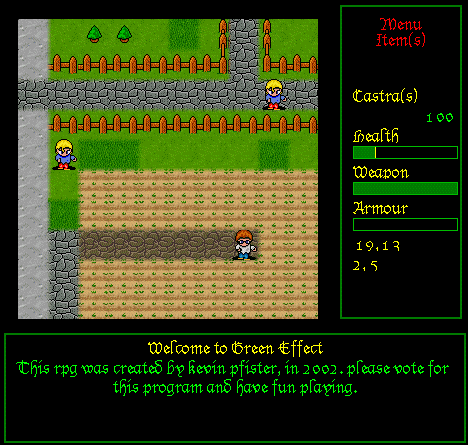



## All New Green Effect RPG V1\.0\.68

### Description

An all new version of Green Effect, a RPG set in the distant past. I have been working on this update for around 6 months, which can be seen by the size of the code(2500+ lines). Includes a map editor, Tile editor and other tools. The Readme file contains the controls and how to edit and update the map.
 
### More Info
 

             |
---                |---
**Submitted On**   |2002-09-01 12:30:40
**By**             |[Kevin Pfister](https://github.com/Planet-Source-Code/PSCIndex/blob/master/ByAuthor/kevin-pfister.md)
**Level**          |Advanced
**User Rating**    |4.7 (28 globes from 6 users)
**Compatibility**  |VB 5\.0, VB 6\.0
**Category**       |[Games](https://github.com/Planet-Source-Code/PSCIndex/blob/master/ByCategory/games__1-38.md)
**World**          |[Visual Basic](https://github.com/Planet-Source-Code/PSCIndex/blob/master/ByWorld/visual-basic.md)
**Archive File**   |[All\_New\_Gr125378912002\.zip](https://github.com/Planet-Source-Code/kevin-pfister-all-new-green-effect-rpg-v1-0-68__1-38574/archive/master.zip)

